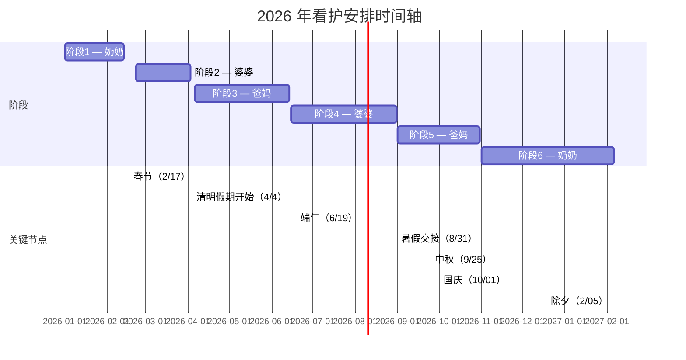

# 2026 年看护安排时间轴

下面是根据你提供的表格生成的 Mermaid 甘特图源代码；你可以在支持 Mermaid 的渲染器中预览或导出为图片。

---

下一步：我可以帮助你将这些文件提交到本地 Git 并推送到你的 GitHub 仓库 `https://github.com/chouhll/it-tech`。

如果你允许我推送，请告诉我你要使用的认证方式：
- 已配置 SSH key（我可以把远程设置为 `git@github.com:chouhll/it-tech.git` 并尝试推送）；
- 或使用 HTTPS + Personal Access Token（请在下一步通过安全方式提供，或你可以在本机手动运行下列命令）。

我已将 Mermaid 源保存为 `timeline.mmd`，并生成了本说明文件 `timeline.md`。